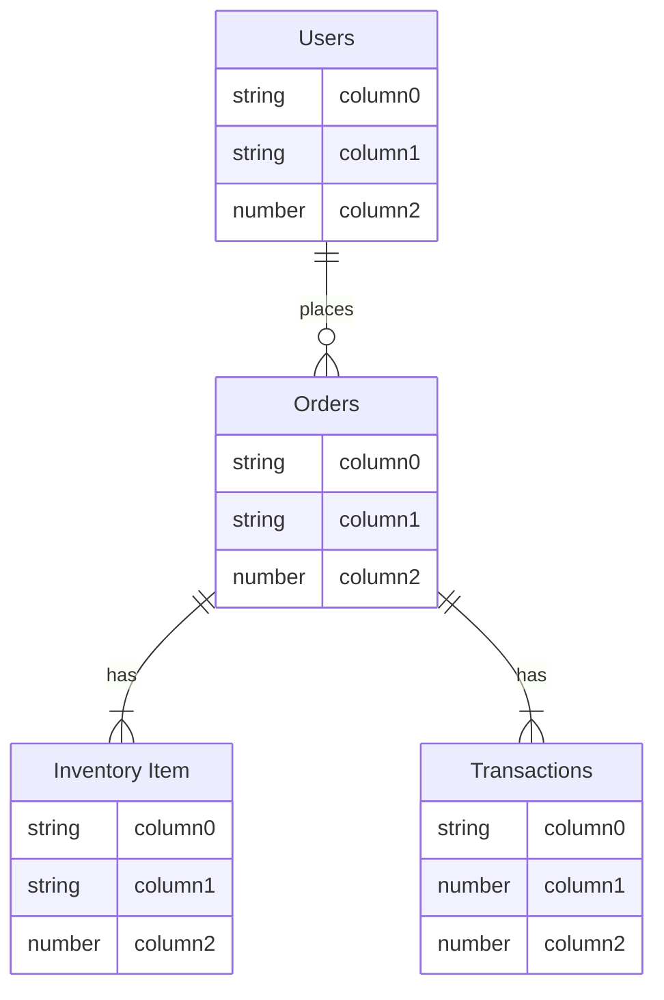
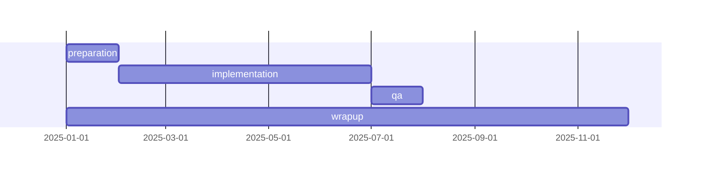

# Fivetran DBT Test

## Purpose
Used to test data ingestion and transformation with fivetran and dbt core.

## Example ERD
Below is an example ERD using mermaid markdown syntax.

# Project Overview

# Project
| date          | status             | item         | notes 
| :-            | :-                 | :-           | :-
| 2025-01-05    | &check;            | ACB          | xdfsfdghhgdfjfgdgfdgdfgdf
| 2025-01-07    |                    | XYZ          | ghghgfghfgfhgh
