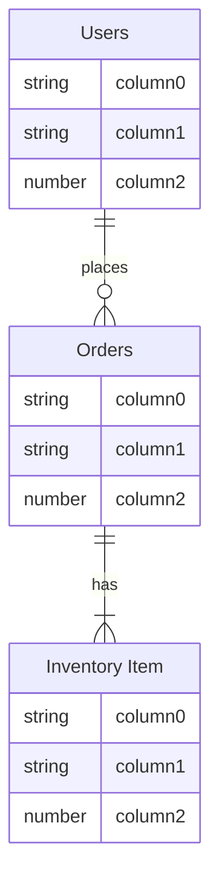

# Fivetran DBT Test

## Purpose
Used to test data ingestion and transformation with fivetran and dbt core.

## Example ERD
Below is an example ERD using mermaid markdown syntax.

```mermaid
%% ------ example erd ---------- %%
erDiagram
    
    %% -------- entities --------- %%

    orders["Orders"] {
        string column0
        string column1
        number column2
    }

    users["Users"] {
        string column0
        string column1
        number column2
    }

    inventory["Inventory Item"] {
        string column0
        string column1
        number column2
    }

    %% -------- relationships --------- %%
    
    users 1 to 0+ orders : places
    orders 1 to 1+ inventory : has
```